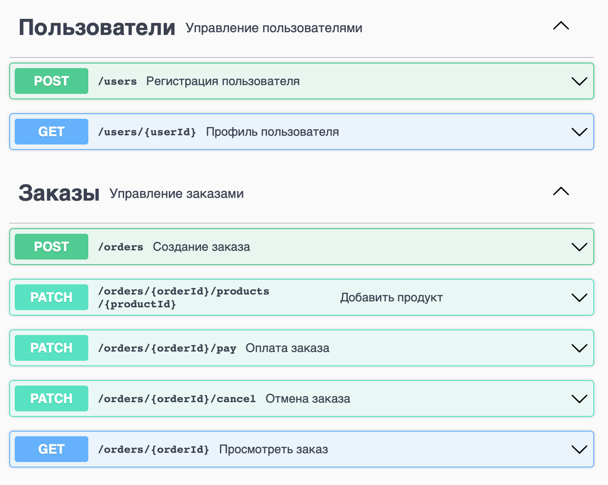
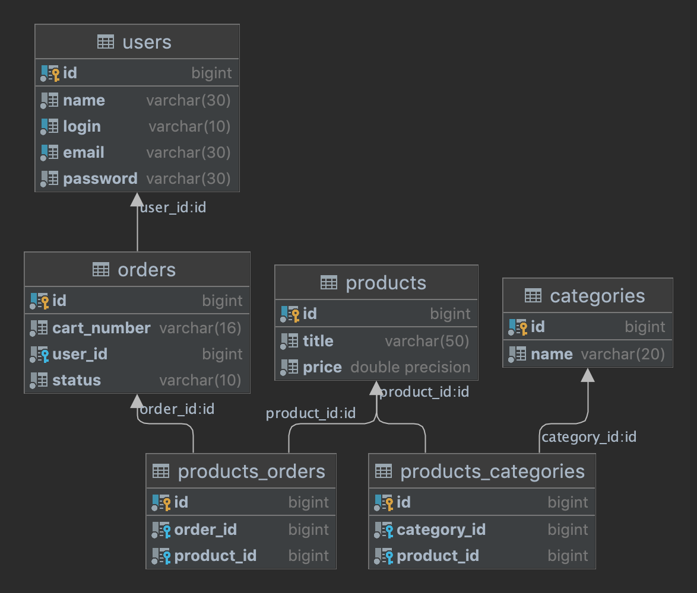

# Smart Shop :shopping_cart:
### Проект:
<p>Приложение реализующее функции интернет магазина для покупки товаров.</p>

---
### Описание сервисов:
REST приложение реализовано с использованием микросервисной архитектуры и базы данных PostgreSQL.

Реализована спецификация API, через [Swagger](https://swagger.io/tools/swagger-editor/).


---
### Схема базы данных


---
### Стек технологий
+ [Java 17](https://www.java.com/)
+ [Spring Boot](https://spring.io/projects/spring-boot)
+ [Hibernate](https://hibernate.org)
+ [PostgreSQL](https://www.postgresql.org)
+ [Docker Compose](https://www.docker.com)
+ [Apache Maven](https://maven.apache.org)
+ [Project Lombok](https://projectlombok.org)
+ [Swagger](https://swagger.io/tools/swagger-editor/)
+ [IntelliJ IDEA](https://www.jetbrains.com/ru-ru/idea/)
---
### Запуск приложения
Потребуется Java 17, Docker, Git, Apache Maven

1. Склонировать
```shell
git clone https://github.com/kal-an/smart-shop
```
2. Собрать проект
```shell
mvn clean package
```
3. Запустить через Docker Compose
```shell
docker compose up
```